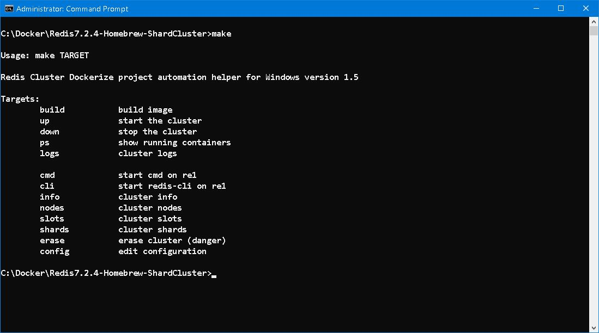
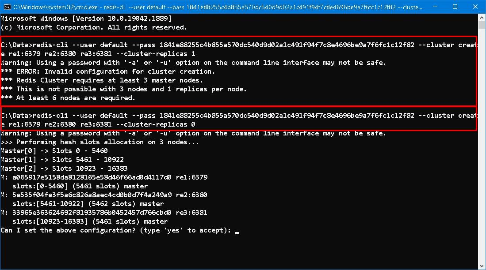

### Redis7.2.4-Homebrew-ShardCluster

Rename `dotenv` to `.env` and set parameters accordingly. 



```
md data 
cd data 
md 6379 6380 6381 6382 6383 6384 6385 6386 6387 
cd ..
```

```
make up 
make cmd 
```

```
redis-cli --user admin --pass 123456 --cluster create re1:6379 re2:6380 re3:6381 re4:6382 re5:6383 re6:6384 re7:6385 re8:6386 re9:6387 --cluster-replicas 2
```

Type `yes` and `enter`. One can use either 
```
redis-cli -c -p 6379 --user alberto --pass 123456 --no-auth-warning 
```

or 
```
redis-cli -c -h 192.168.1.11 -p 6379 --user alberto --pass 123456 --no-auth-warning
```

connect to `re1`. The rest is history...

---
### [The Road Not Taken](https://www.poetryfoundation.org/poems/44272/the-road-not-taken)

["With great power comes great responsibility."](https://en.wikipedia.org/wiki/With_great_power_comes_great_responsibility)


#### I. System Setup 
Combining instructions on [RU301](https://redis.io/university/courses/ru301/) and experience from [Redis7.2.4-Homebrew-Replication](https://github.com/Albert0i/Redis7.2.4-Homebrew-Replication), a version of `redis.conf` is devised for each node, nine in total. 
```
# redis.conf file
port 6379
cluster-enabled yes
cluster-config-file nodes6379.conf
cluster-node-timeout 5000

# Create a strong password here
requirepass 1841e88255c4b855a570dc540d9d02a1c491f94f7c8e4696be9a7f6fc1c12f82

# AUTH password of the primary instance in case this instance becomes a replica
masterauth 1841e88255c4b855a570dc540d9d02a1c491f94f7c8e4696be9a7f6fc1c12f82
. . . 
```  

It is *recommended* to have a minimum of 3 master nodes and each with 2 replicas. 



It is completely *possible* to create cluster with 3 master nodes... ONLY! That means no replica is involved and works as expected, fails as expected... 


We are going to create a 3x3 redis shard cluster with: 
```
redis-cli --user default --pass 1841e88255c4b855a570dc540d9d02a1c491f94f7c8e4696be9a7f6fc1c12f82 --cluster create re1:6379 re2:6380 re3:6381 re4:6382 re5:6383 re6:6384 re7:6385 re8:6386 re9:6387 --cluster-replicas 2
```


#### II. Stress test
In terminal 1
```
npm test

counter=1
counter=2
counter=3
. . . 
```

In terminal 2
```
make cli

127.0.0.1:6379> get counter
-> Redirected to slot [6680] located at 192.168.1.12:6380
"62"
192.168.1.12:6380>
```

According to our network setting, the `counter` key is stored in node number two. 
```
docker-compose stop re2
```

Terminal stop for a while and then restarts counting. To repeat the previous step and continue to stop node number 8 
```
docker-compose stop re8
```

And then node number 7
```
docker-compose stop re7
```

And then node number 4
```
docker-compose stop re4
```

And then node number 5
```
docker-compose stop re5
```

Finally, the counter stopped!. Have look of the node status 
```
make nodes

redis-cli --user default --pass 1841e88255c4b855a570dc540d9d02a1c491f94f7c8e4696be9a7f6fc1c12f82 --no-auth-warning cluster nodes
a7facd62757cda728a1f07d5beb388fe8a2d17f3 192.168.1.15:6383@16383 master,fail - 1720509111957 1720509109454 13 connected 5461-10922
baed8301870ca201aec0df9f69ea58b827dfee90 192.168.1.19:6387@16387 slave c3157080281b5cd36bfde04ef1c915d886e614ae 0 1720509155510 3 connected
c3157080281b5cd36bfde04ef1c915d886e614ae 192.168.1.13:6381@16381 master - 0 1720509156618 3 connected 10923-16383
bed32b9b2247b0f5f5027d083622ec5ab59d5f55 192.168.1.18:6386@16386 master,fail - 1720508881571 1720508879000 10 connected
e7b65b6fb615ed6752a43445a4b2670cb573a73a 192.168.1.17:6385@16385 master,fail - 1720508985501 1720508983000 11 connected
50022b8b39ef191bca8ffaa85adf2b6fa9ed71f2 192.168.1.11:6379@16379 myself,master - 0 0 1 connected 0-5460
ee28a52b3c4ac1a601a3565562991c42c23fd80d 192.168.1.16:6384@16384 slave 50022b8b39ef191bca8ffaa85adf2b6fa9ed71f2 0 1720509155000 1 connected
987161d548578b5e33587494440a50c78862ae2e 192.168.1.14:6382@16382 master,fail - 1720509058673 1720509056084 12 connected
efc3c9e32fa740464eb26317bbaa526a9fa0c0bd 192.168.1.12:6380@16380 master,fail - 1720508652613 1720508650000 2 connected
```

Five master nodes failed, two master nodes and one slave node remain. Which means for a 3x3 cluster, at most four nodes can fail. 


#### III. [Cluster Manager Command](redis-cli-cluster.txt)


#### IV. [Cluster subcommands](cluster-subcommand.txt)


#### V. Bibliography
1. [Redis cluster specification](https://redis.io/docs/latest/operate/oss_and_stack/reference/cluster-spec/)
2. [Redis configuration](https://redis.io/docs/latest/operate/oss_and_stack/management/config/)
3. [Question: What are the limitations of a Redis cluster?](https://www.dragonflydb.io/faq/limitations-of-redis-cluster)


### EOF (2024/07/12)